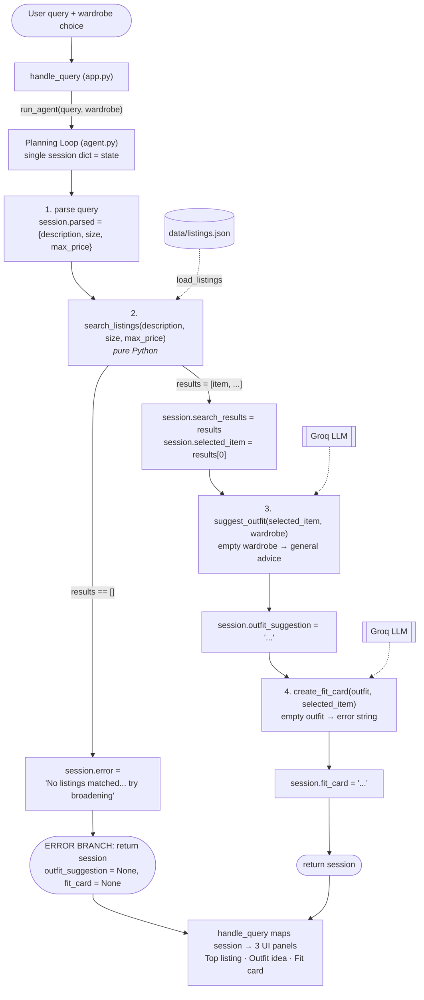

# FitFindr — planning.md

<!-- > Complete this document before writing any implementation code.
> Your spec and agent diagram are what you'll use to direct AI tools (Claude, Copilot, etc.) to generate your implementation — the more specific they are, the more useful the generated code will be.
> Your planning.md will be reviewed as part of your submission.
> Update it before starting any stretch features. -->

---

## What FitFindr Does (2–3 sentence summary)

FitFindr is a secondhand-shopping styling agent: given a natural-language request, it searches a mock listings dataset for matching thrift/resale pieces, picks the best one, suggests how to style that piece against the user's existing wardrobe, and then writes a short, shareable "fit card" caption for the find. The agent runs as a fixed three-step planning loop — `search_listings` → `suggest_outfit` → `create_fit_card` — passing state between steps through a single session dict. Each step has a guarded failure path: if `search_listings` returns no matches the loop stops immediately with a helpful "try this instead" message and never calls the styling tools with empty input; an empty wardrobe falls back to general styling advice rather than crashing.

---

## Tools

List every tool your agent will use. For each tool, fill in all four fields.
You must have at least 3 tools. The three required tools are listed — add any additional tools below them.

### Tool 1: search_listings

**What it does:**
Searches the 40-item mock listings dataset (`data/listings.json`, loaded via `load_listings()`) for items matching the user's keywords, then applies optional size and price filters and returns the matches ranked by keyword relevance. It is pure Python — no LLM call.

**Input parameters:**
- `description` (str): free-text keywords describing what the user wants, e.g. `"vintage graphic tee"`. Each whitespace-separated word is treated as a keyword and matched (case-insensitively, substring) against each listing's `title`, `description`, `category`, and `style_tags`.
- `size` (str | None): a size string to filter on, e.g. `"M"`. Matching is case-insensitive substring (`"m"` matches `"S/M"` and `"M/L"`). `None` skips size filtering.
- `max_price` (float | None): inclusive maximum price. A listing passes if `listing["price"] <= max_price`. `None` skips price filtering.

**What it returns:**
A `list[dict]` of matching listing dicts, sorted by relevance score (highest first). Each dict carries all original listing fields: `id`, `title`, `description`, `category`, `style_tags` (list), `size`, `condition`, `price` (float), `colors` (list), `brand` (str | None), `platform`. Listings whose keyword-overlap score is 0 are dropped. Returns `[]` when nothing matches.

**What happens if it fails or returns nothing:**
It never raises — it returns `[]`. The planning loop detects the empty list, writes a specific, actionable message to `session["error"]` (telling the user to broaden keywords / raise the price / drop the size filter), and returns early **without** calling `suggest_outfit` or `create_fit_card`.

---

### Tool 2: suggest_outfit

**What it does:**
Given the selected listing and the user's wardrobe, asks the LLM (Groq `llama-3.3-70b-versatile`) to propose 1–2 concrete outfits styling the new item with named pieces from the wardrobe, including a short note on how to wear it (tuck, roll, layer, etc.).

**Input parameters:**
- `new_item` (dict): the listing dict chosen by the planning loop (top search result). The tool reads its `title`, `category`, `colors`, `style_tags`, and `condition` into the prompt.
- `wardrobe` (dict): a wardrobe dict shaped `{"items": [ {id, name, category, colors, style_tags, notes}, ... ]}`. May be empty (`items == []`) — handled explicitly.

**What it returns:**
A non-empty `str` of natural-language styling advice. With a populated wardrobe it names specific wardrobe pieces ("pair with your baggy straight-leg jeans and chunky white sneakers"). With an empty wardrobe it returns general styling advice (what silhouettes/colors/occasions the piece suits) instead of referencing nonexistent items.

**What happens if it fails or returns nothing:**
If `wardrobe["items"]` is empty it switches to the general-advice prompt rather than failing. If the LLM call raises (network/API error) the tool catches the exception and returns a safe fallback string describing the item generically, so the loop can still proceed to `create_fit_card`. It never returns an empty string.

---

### Tool 3: create_fit_card

**What it does:**
Turns the outfit suggestion and the new item into a short, casual, shareable social-media caption ("fit card") for the thrifted find. Uses the LLM at a higher temperature so repeated runs produce varied captions.

**Input parameters:**
- `outfit` (str): the styling-advice string returned by `suggest_outfit()`. Used as the creative basis for the caption.
- `new_item` (dict): the listing dict, so the caption can naturally mention the item `title`, `price`, and `platform` (each once).

**What it returns:**
A 2–4 sentence casual caption `str` suitable for Instagram/TikTok — first-person, authentic OOTD voice, mentioning item name, price, and platform once each, capturing the outfit vibe. Output varies across runs (temperature ≈ 0.9).

**What happens if it fails or returns nothing:**
If `outfit` is empty/whitespace-only, it returns a descriptive error-message string (e.g. `"Can't make a fit card — no outfit suggestion was provided."`) instead of raising. If the LLM call raises, it catches and returns a short fallback caption built from the item fields, so the UI always has something to show.

---

### Additional Tools (stretch features)

#### Tool 4: estimate_price_fairness (Stretch — Price comparison)

**What it does:** Given a listing, estimates whether its price is fair by comparing it against
comparable listings in the dataset (same `category`, overlapping `style_tags`). Pure Python — no LLM.

**Input parameters:**
- `item` (dict): a listing dict (the selected item).
- `listings` (list[dict] | None): the pool to compare against; defaults to the full dataset via `load_listings()`.

**What it returns:** a dict `{"verdict": str, "item_price": float, "comp_count": int, "comp_avg": float | None, "comp_low": float | None, "comp_high": float | None, "message": str}`.
`verdict` is one of `"great deal"`, `"fair"`, `"a bit high"`, or `"no comparables"`. `message` is a one-line
human-readable summary (e.g. *"$24 vs. an avg of $21 for similar graphic tees — fair price."*).

**What happens if it fails or returns nothing:** If there are no comparable listings, it returns
`verdict="no comparables"` with `comp_count=0` and a message saying it can't judge the price — never raises.

#### Tool 5: get_trending_styles (Stretch — Trend awareness)

**What it does:** Surfaces which style tags are "currently popular" in (optionally) a given size range,
by aggregating tag frequency across the listings dataset as a stand-in for live platform activity.
(Mocked: there is no real external platform, so the dataset stands in for "recent posts/tags".) Pure Python.

**Input parameters:**
- `size` (str | None): optional size filter (same case-insensitive substring match as search).
- `top_n` (int): how many trending tags to return (default 5).

**What it returns:** a list of `{"tag": str, "count": int}` dicts, most popular first. `[]` if nothing
matches the size filter.

**What happens if it fails or returns nothing:** Returns `[]` (the loop/UI just omits the trend note) — never raises.

#### Style profile memory (Stretch — persistence, not a tool)

A small persistence layer (`profile.py`) saves/loads a JSON style profile to
`data/user_profile.json`: the user's wardrobe plus a `preferred_styles` list (learned from the tags of
items they search/select). `load_profile()` returns the saved wardrobe so a returning user doesn't
re-enter it; `update_profile_from_session(session)` records the style tags of the selected item.
Failure modes: a missing/corrupt file returns an empty default profile (never raises).

---

## Planning Loop

**How does your agent decide which tool to call next?**

The loop is a **fixed, conditional pipeline** driven by the contents of the session dict — not a free-form "LLM decides" loop. The sequence is always search → suggest → card, but it branches and can terminate early:

1. **Parse.** Extract `description`, `size`, and `max_price` from the raw query with a lightweight regex/string parser (price from `under $30` / `$30` / `30 dollars`; size from a `size M` pattern or a standalone size token; description is the cleaned remaining text). Store in `session["parsed"]`.
2. **Search.** Call `search_listings(description, size, max_price)`; store in `session["search_results"]`.
   - **Branch (error):** `if not session["search_results"]:` set `session["error"]` to a helpful message and `return session` immediately. **Do not** call the styling tools. This is the visible error branch.
   - **Branch (success):** `session["selected_item"] = session["search_results"][0]` (top-ranked match) and continue.
3. **Suggest.** Call `suggest_outfit(session["selected_item"], session["wardrobe"])`; store in `session["outfit_suggestion"]`. (This tool internally branches on empty vs. populated wardrobe — the loop doesn't need to.)
4. **Card.** Call `create_fit_card(session["outfit_suggestion"], session["selected_item"])`; store in `session["fit_card"]`.
5. **Done.** `return session`. The caller checks `session["error"]` first; if `None`, the three result fields are populated.

The loop "knows it's done" when it reaches step 5 (all three outputs set) **or** when the search branch terminates early with an error set. Behavior differs by input: an impossible query stops after step 2 with `fit_card is None`; a matchable query runs all three steps.

---

## State Management

**How does information from one tool get passed to the next?**

All state for one interaction lives in a single **session dict** created by `_new_session(query, wardrobe)` in `agent.py`. It is the single source of truth and is threaded through every step:

| Key | Set by | Read by |
|-----|--------|---------|
| `query` | caller | parser (step 1) |
| `parsed` | step 1 (parser) | step 2 (search args) |
| `wardrobe` | caller | step 3 (`suggest_outfit`) |
| `search_results` | step 2 | step 2 branch + step 4 selection |
| `selected_item` | step 2 success branch | steps 3 & 4 |
| `outfit_suggestion` | step 3 | step 4 |
| `fit_card` | step 4 | UI |
| `error` | step 2 error branch | caller / UI (checked first) |

No globals and no re-prompting: each tool receives exactly what the previous step wrote into the session. The **exact same `selected_item` dict** written in step 2 is the object passed into both `suggest_outfit` and `create_fit_card`, so the find shown in the listing panel is provably the find that was styled and captioned. `run_agent()` returns the completed session; `handle_query()` in `app.py` maps its fields onto the three UI panels.

---

## Error Handling

For each tool, describe the specific failure mode you're handling and what the agent does in response.

| Tool | Failure mode | Agent response |
|------|-------------|----------------|
| search_listings | No results match the query | Loop sets `session["error"]` to: *"No listings matched '<query>'. Try broadening your keywords, raising your max price, or removing the size filter."* Returns early; `outfit_suggestion` and `fit_card` stay `None`. Never calls the styling tools on empty input. |
| suggest_outfit | Wardrobe is empty (`items == []`) | Detects empty wardrobe and calls the LLM with a *general styling advice* prompt (silhouettes, colors, occasions, what to pair it with) instead of referencing nonexistent pieces. Returns a useful non-empty string so the loop continues. If the LLM call itself errors, returns a safe generic fallback string. |
| create_fit_card | Outfit input is missing or incomplete | If `outfit` is empty/whitespace, returns a descriptive message string (*"Can't make a fit card — no outfit suggestion was provided."*) rather than raising. If the LLM call errors, returns a short fallback caption built from the item's title/price/platform. |

---

## Architecture

---

## AI Tool Plan

**Milestone 3 — Individual tool implementations:**

- **`search_listings`** — Tool: **Claude (Claude Code)**. Input: the Tool 1 block above (inputs, return value, failure mode) plus the `load_listings()` docstring from `utils/data_loader.py`. Expected output: a pure-Python function that filters by `max_price` and `size`, scores listings by keyword overlap against `title`/`description`/`category`/`style_tags`, drops zero-score listings, and returns sorted dicts. Verification before trusting: confirm it (a) filters on all three params, (b) returns `[]` (not an exception) for impossible queries, (c) every returned item respects the price cap. Then run the three pytest cases (results / empty / price filter).
- **`suggest_outfit`** — Tool: **Claude**. Input: the Tool 2 block + the wardrobe schema (`data/wardrobe_schema.json`). Expected output: a function that branches on `wardrobe["items"]` empty vs. populated, builds the matching prompt, calls Groq `llama-3.3-70b-versatile`, and try/except-wraps the call. Verification: run once with `get_example_wardrobe()` (must name real wardrobe pieces) and once with `get_empty_wardrobe()` (must give general advice, non-empty, no crash).
- **`create_fit_card`** — Tool: **Claude**. Input: the Tool 3 block. Expected output: a function guarding empty `outfit`, prompting for a casual caption at temperature ≈ 0.9, returning the string. Verification: empty-outfit input returns an error string (not an exception); same valid input run 3× yields varied captions (bump temperature if identical).

**Milestone 4 — Planning loop and state management:**

- Tool: **Claude**. Input: the **Architecture diagram** (ASCII + Mermaid) plus the **Planning Loop** and **State Management** sections above. Expected output: `run_agent()` that initializes the session via `_new_session()`, parses the query, calls `search_listings`, **branches on the empty result (early return with error set)**, selects `results[0]`, then calls `suggest_outfit` and `create_fit_card`, storing each result in the session. Verification before trusting: confirm it (a) branches on the search result rather than calling all three tools unconditionally, (b) writes every value into the session dict, (c) on the no-results query leaves `fit_card is None` and `error` set. Test with both the happy-path and the deliberate no-results query already in `agent.py`.

---

## A Complete Interaction (Step by Step)

Write out what a full user interaction looks like from start to finish — tool call by tool call. Use a specific example query.

**Example user query:** "I'm looking for a vintage graphic tee under $30. I mostly wear baggy jeans and chunky sneakers. What's out there and how would I style it?"

**Step 1 — Parse:** The loop parses the query into `session["parsed"] = {"description": "vintage graphic tee", "size": None, "max_price": 30.0}` (price extracted from "under $30"; no explicit size given).

**Step 2 — Search:** Calls `search_listings("vintage graphic tee", size=None, max_price=30.0)`. Listings are scored by keyword overlap on "vintage/graphic/tee" and filtered to `price <= 30`. Matches include the Y2K Baby Tee ($18), the 2003 bootleg-style Graphic Tee ($24), and the Vintage Band Tee ($19). The list is non-empty, so `session["search_results"]` is set and `session["selected_item"]` is the top-ranked result (the strongest keyword match, e.g. the bootleg-style **Graphic Tee — $24, depop, good condition**). The error branch is skipped.

**Step 3 — Suggest outfit:** Calls `suggest_outfit(<selected graphic tee>, <example wardrobe>)`. The LLM sees the tee plus the user's real pieces and returns something like: *"Tuck the front of this faded graphic tee into your baggy straight-leg jeans and finish with the chunky white sneakers for an easy 90s streetwear fit. Layer the vintage black denim jacket on top when it's cooler."* Stored in `session["outfit_suggestion"]`.

**Step 4 — Fit card:** Calls `create_fit_card(<that suggestion>, <selected graphic tee>)`. The LLM returns a casual caption like: *"found this faded graphic tee on depop for $24 and it's already my most-worn 🖤 tucked into baggy jeans + chunky sneakers, threw the denim jacket over it. peak thrift luck."* Stored in `session["fit_card"]`.

**Final output to user:** The Gradio UI shows three panels — **Top listing** (title, price, platform, condition, size of the selected tee), **Outfit idea** (the step-3 styling text), and **Your fit card** (the step-4 caption). `session["error"]` is `None`.

**Error-path variant:** For the query *"designer ballgown size XXS under $5"*, step 2 returns `[]`. The loop sets `session["error"] = "No listings matched ... Try broadening your keywords, raising your max price, or removing the size filter."`, returns early, and the UI shows that message in the listing panel with the other two panels empty — `suggest_outfit` and `create_fit_card` are never called.

---

## Stretch Features

All four stretch features are implemented. `planning.md` was updated (above) before building each.

### 1. Price comparison tool (`estimate_price_fairness`)
Added as Tool 4. After the loop selects an item, it runs this tool and stores the verdict in
`session["price_check"]`. The UI shows the fairness line under the listing. See Tool 4 spec above.

### 2. Style profile memory (`profile.py`)
A persistence layer keyed to `data/user_profile.json`. On the UI's "Saved profile" wardrobe option,
the agent loads the stored wardrobe instead of requiring re-entry; after a successful run it records the
selected item's style tags into `preferred_styles`. Corrupt/missing files degrade to an empty profile.

### 3. Trend awareness tool (`get_trending_styles`)
Added as Tool 5. The loop calls it with the parsed size and stores the top tags in
`session["trending"]`; the UI appends a short "trending in your size" note. Mocked from the dataset
since there's no live platform to query.

### 4. Retry logic with fallback (in the planning loop)
This is the key change to the planning loop: when `search_listings` returns `[]`, the agent does **not**
immediately give up. It retries with progressively loosened constraints and records what it changed in
`session["adjustments"]`:

1. Original: `search_listings(description, size, max_price)`
2. If empty → drop the **size** filter and retry.
3. If still empty → also drop the **price** filter and retry.
4. If still empty → set `session["error"]` and stop.

On a successful retry the agent tells the user exactly what was relaxed (e.g. *"No exact match for size M
under $20 — showing results with the size filter removed."*) via `session["adjustments"]`, so the loosening
is transparent. This makes the loop genuinely adaptive: identical-looking queries take different paths
depending on what the dataset returns at each step.

### Updated session fields (stretch)
`price_check` (dict), `trending` (list), `adjustments` (list[str]) are added to the session dict.
